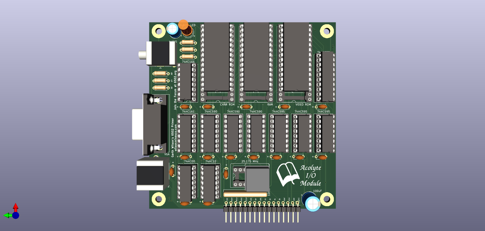

# SerialVGA

Serial VGA Module

Displays ~80x60 monochrome characters on a VGA monitor.   Includes PS/2 Keyboard port and 3.5mm Audio jack with minimal circuitry.

See code example for use of all features.

